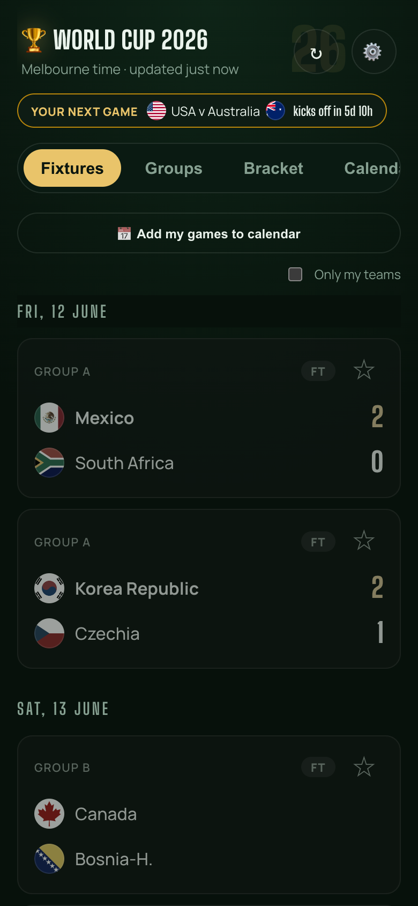
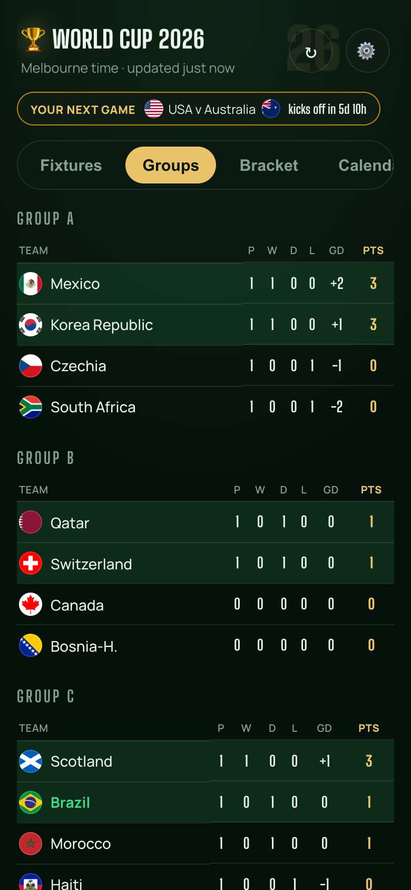
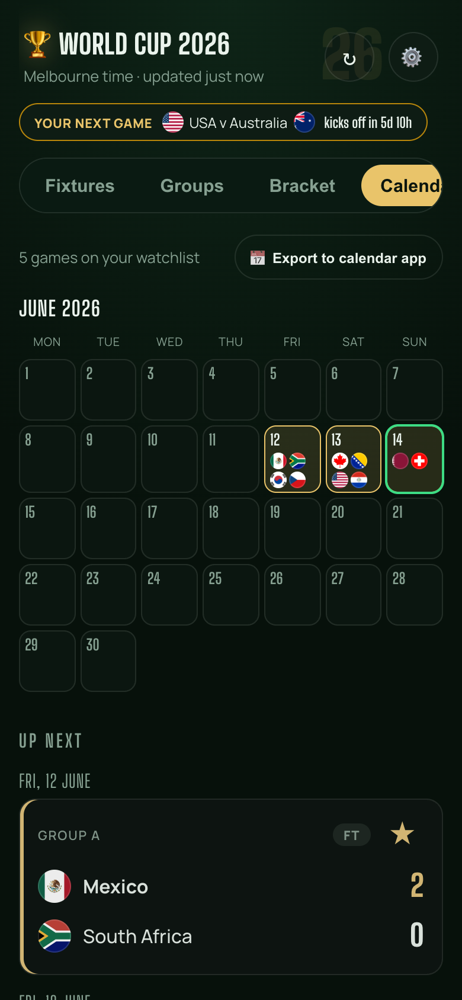
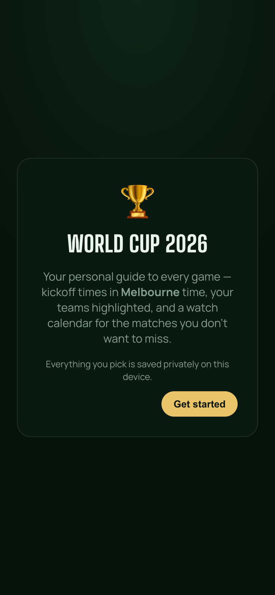
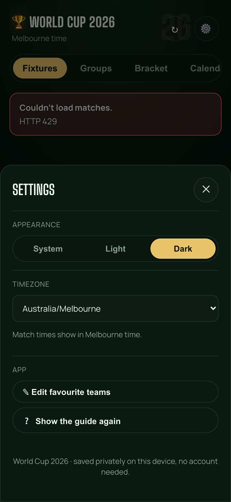
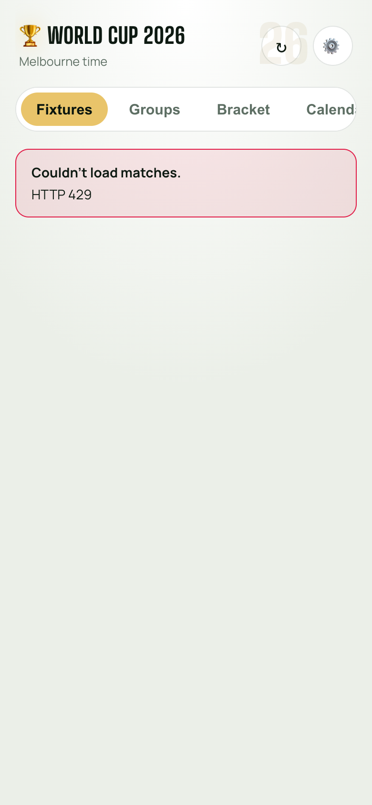

<h1 align="center">🏆 World Cup 2026 — My Bracket</h1>

<p align="center">
  <b>Your personal World Cup planner.</b> Every game in <i>your</i> local time, your teams
  highlighted, live standings, a knockout bracket, and a watch calendar — installable on
  your phone like a native app.
</p>

<p align="center">
  <a href="https://fahim8371.github.io/worldcup-bracket/">
    
  </a>
</p>

<p align="center">
  
  
  
  
  
</p>

---

## 📱 Get the app

**Live:** **https://fahim8371.github.io/worldcup-bracket/**

Install it on your iPhone so it runs fullscreen with its own icon (no Safari bars):

1. Open the link above in **Safari**.
2. Tap the **Share** button (the square with an up-arrow).
3. Tap **Add to Home Screen** → **Add**.

That's it — a trophy icon lands on your home screen. It never expires and updates itself.
On Android/desktop Chrome, use **Install app** from the address bar / menu.

---

## ✨ Screenshots

<p align="center">
  
  
  
</p>
<p align="center">
  
  
  
</p>

---

## ⚽ Features

- **🌍 Your local time** — auto-detects your device timezone; every kickoff and calendar
  entry shows in your zone. Change it anytime in Settings.
- **⭐ Your teams, highlighted** — pick favourite nations; their games get a green edge.
  Every other game is still shown (greyed but readable) so you never miss a score.
- **📋 Fixtures** — date-grouped, auto-scrolls to today, with real circular flag chips.
- **📊 Groups** — live standings for all 12 groups (P / W / D / L / GD / Pts), top-two
  qualifying highlighted.
- **🏆 Bracket** — the knockout tree, filling in as the tournament progresses.
- **📅 Watch calendar** — tap the ☆ on any game to add it; get a month view, an
  "Up Next" agenda, and one-tap **export to your calendar** (`.ics`).
- **🔴 Live strip** — in-play games plus a ticking countdown to your next game.
- **👆 Tap a match** — opens the Google live-score panel for that fixture.
- **🌗 Dark / light theme** and a quick **↻ Update scores** button.
- **🔒 Private** — favourites, watchlist and settings live only on your device
  (`localStorage`). No account, no tracking, no backend.

---

## 🔄 How match data works

Scores and fixtures come from [football-data.org](https://www.football-data.org). The
app is a static site (GitHub Pages), so a **GitHub Action fetches the data with a hidden
API key and bakes it into the site**, then redeploys. The key is stored as a repo secret
and never reaches the browser.

- The app **auto-refreshes** and has a manual **↻ Update scores** button in the header
  that re-pulls the latest published snapshot (and shows how long ago it updated).
- To force a brand-new snapshot, run the **Build & deploy** workflow from the
  [Actions tab](https://github.com/Fahim8371/worldcup-bracket/actions)
  (**Run workflow**), then tap **↻ Update scores** in the app.

> Note: the free football-data tier has slightly delayed scores and no live match-minute,
> so the app shows the running score but not the clock.

---

## 🛠️ Run it locally

```bash
git clone https://github.com/Fahim8371/worldcup-bracket.git
cd worldcup-bracket
npm install

# free key from football-data.org/client/register
echo "FOOTBALL_DATA_TOKEN=your_token_here" > .env

npm run dev   # → http://localhost:5173
```

In dev, requests go through the Vite proxy (`vite.config.js`), which injects the API key
server-side so it stays out of the browser bundle.

---

## 🚀 Deploy

Hosted on **GitHub Pages** via [`.github/workflows/deploy.yml`](.github/workflows/deploy.yml):
every push to `main` (and on a schedule) it fetches fresh data using the
`FOOTBALL_DATA_TOKEN` repo secret, builds with Vite, and publishes to Pages.

To deploy your own copy: fork → set the `FOOTBALL_DATA_TOKEN` secret
(*Settings → Secrets and variables → Actions*) → enable Pages (*Settings → Pages → Source:
GitHub Actions*) → push.

---

## 🧱 Tech

React + Vite · PWA (manifest + service worker, offline-capable) · `localStorage` for
prefs · `Intl` for timezone-aware formatting · flag chips from
[flagcdn](https://flagcdn.com) · type set in **Big Shoulders Display** + **Manrope**.
Visual system: **"Broadcast Pitch."**

<p align="center"><sub>Built for the 2026 FIFA World Cup. Not affiliated with FIFA. ⚽</sub></p>
